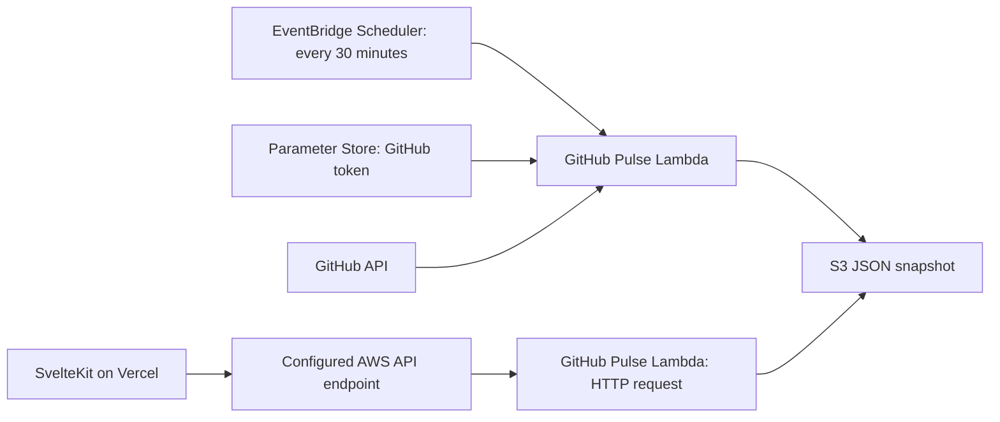

# Portfolio AWS integration

## Existing deployment

Read-only inspection on September 5, 2026 confirmed:

- Region: `ap-southeast-1` (Singapore).
- Lambda: `github-pulse`, Node.js 24, 128 MB memory, 10-second timeout.
- EventBridge Scheduler: `github-pulse-refresh`, enabled, `rate(30 minutes)`, flexible window off.
- The Lambda stores `github-pulse.json` in its configured private S3 cache bucket.
- The GitHub token is read from an SSM Parameter Store parameter with decryption.



S3 already provides persistent snapshot storage, so these features do not need a DynamoDB table or another schedule. No AWS resources were modified for this change.

## Portfolio behavior

`GITHUB_PULSE_API_URL` is the existing server-only endpoint setting. The SvelteKit loader reads the snapshot and caches it in memory for 30 minutes. This means updates can take approximately an additional cache interval to reach visitors. If AWS is unavailable, the existing loader falls back to GitHub.

The Currently building section displays up to three public events within 30 days of the snapshot timestamp. It shows the actual snapshot timestamp in UTC and an empty or unavailable state where appropriate. It does not infer project completion or use AI.

Explore my experience contains curated answers and opens the existing project case-study drawer. Update its copy in `src/lib/components/portfolio/experience/ExperienceGuide.svelte`; related case studies come from `src/lib/data/projects.ts`.

## Verification and release

Run `npm.cmd run check` and `npm.cmd run build` on Windows. Publish the frontend through the existing Vercel workflow after reviewing the changes. No Lambda upload or new environment variable is required.

To inspect the schedule without changing it:

```powershell
aws scheduler get-schedule --name github-pulse-refresh --region ap-southeast-1
```

The existing Lambda refreshes on any non-HTTP invocation. HTTP requests read S3, with a GitHub refresh fallback if the cache cannot be read. A failed scheduled refresh leaves the last successful object intact; the visible timestamp lets visitors distinguish an older snapshot from a fresh one.
